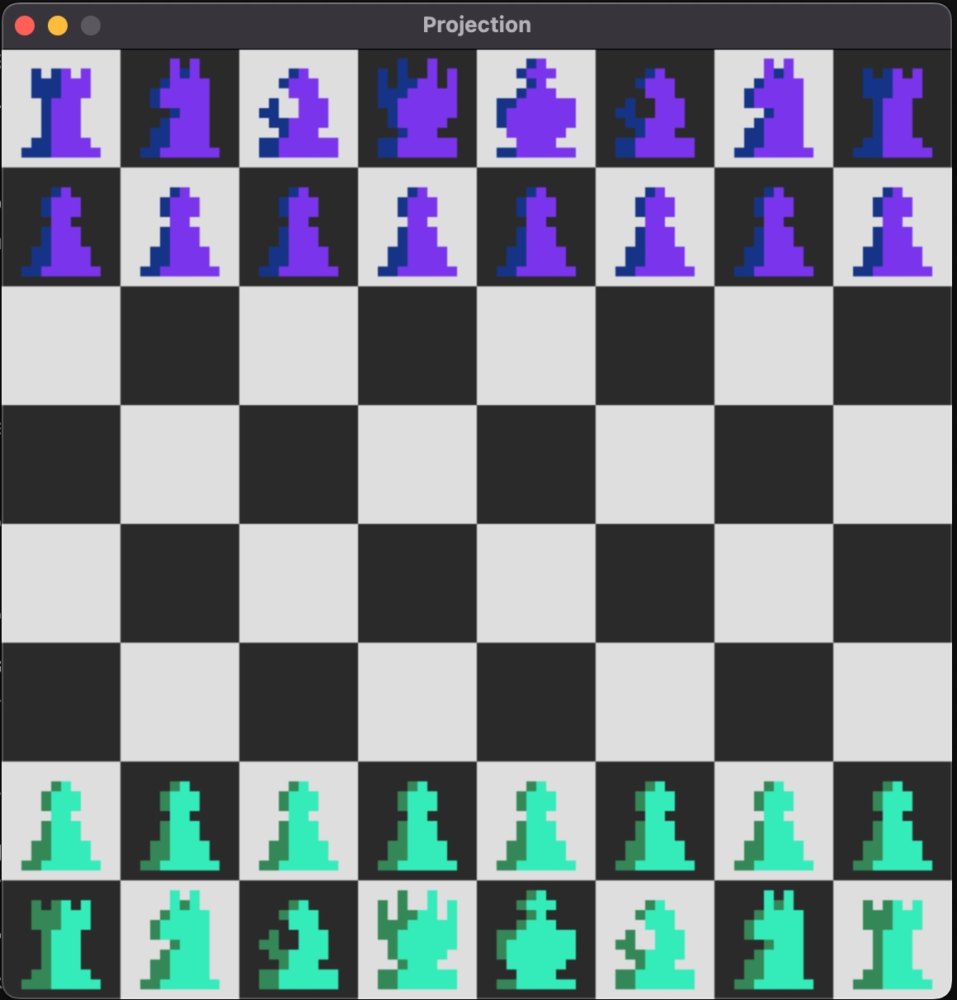

# Chess Game using the SDL2 library
Chess AI that is in the works. The Goal is to be able to write something that can beat me and then I will train to beat it. Also this is a precursor to a Gungi Engine I want to make.

The AI uses a Monte Carlo Search Tree in order to find the best moves. During the expansion phase of the MCTS Algorithm, moves are selected using a reasonably sized Neural Net (10 Hidden * 100 Nodes Each).

Improvements in the design will come form improved tokenization of the board. Currently the input size is 672. The output is of size 128. 

I like the current design because it can allow for trading scenarios to be searched first. The output is of size 128. The 128 is broken into two sets representing the chosen source and destination squares of the moves to be explored.

## The Board:

</img>

### To Compile:
g++ --std=c++11 -DSIZE=6 chess_main.cc -o m -I include -L lib -l SDL2-2.0.0

### Improvements:
En Passant and Castling have yet to be implemented because, while such a feature would be easy to add, it needs to be seamless because the Chess Logic Code is used for the AI Move Generation.

Create training sets use a python script that connects to a python chess api. Also train some nets.

A lot more.